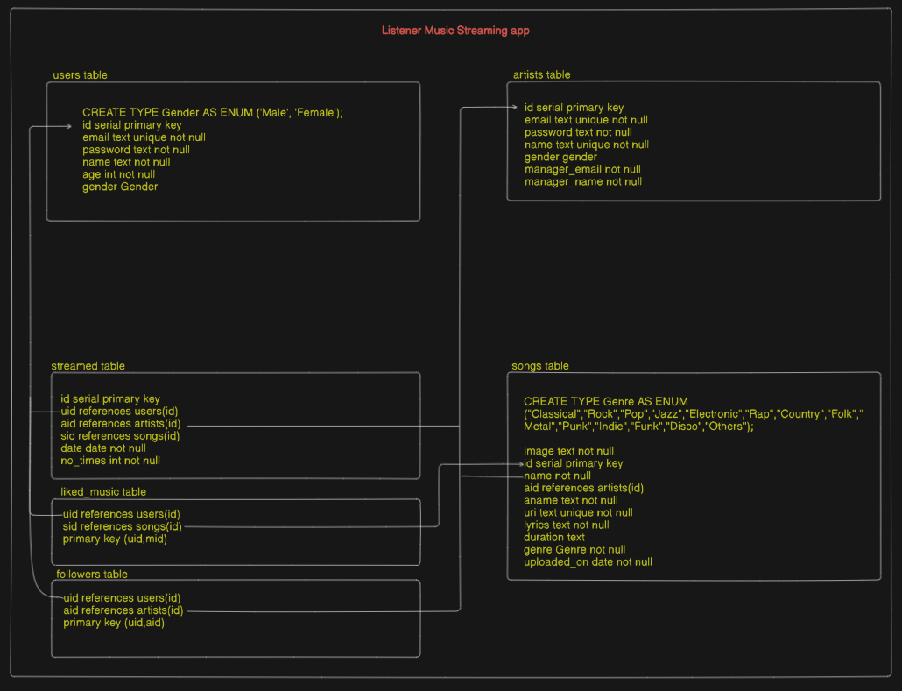

# ⭐ TABLES ( DDL commands )

### 🌀 ENUM TYPES
---
CREATE TYPE Gender AS ENUM ('Male', 'Female');

CREATE TYPE Genre AS ENUM (   
    'Classical', 'Rock', 'Pop', 'Jazz',    'Electronic', 'Rap',    
    'Country', 'Folk', 'Metal', 'Punk', 'Indie', 'Funk', 'Disco', 'Others'   
);

---
### 🎟️ USERS TABLE

CREATE TABLE users (   
    id SERIAL PRIMARY KEY,   
    email TEXT UNIQUE NOT NULL,   
    password TEXT NOT NULL,   
    name TEXT NOT NULL,   
    age INT NOT NULL,   
    gender Gender NOT NULL   
);

---
### 🎟️ ARTISTS TABLE

CREATE TABLE artists (   
    id SERIAL PRIMARY KEY,   
    email TEXT UNIQUE NOT NULL,   
    password TEXT NOT NULL,   
    name TEXT UNIQUE NOT NULL,   
    gender Gender NOT NULL,   
    manager_email TEXT NOT NULL,   
    manager_name TEXT NOT NULL   
);

---
### 🎟️ SONGS TABLE

CREATE TABLE songs (   
    id SERIAL PRIMARY KEY,   
    name TEXT NOT NULL,   
    aid INT REFERENCES artists(id) ON DELETE CASCADE,      
    url TEXT UNIQUE NOT NULL,   
    lyrics TEXT NOT NULL,   
    duration TEXT,   
    genre Genre NOT NULL,   
    uploaded_on DATE NOT NULL   
);   
ALTER table songs add column img text not null;

---
### 🎟️ STREAMED TABLE

CREATE TABLE streamed (   
    id SERIAL PRIMARY KEY,   
    uid INT REFERENCES users(id) ON DELETE CASCADE,   
    sid INT REFERENCES songs(id) ON DELETE CASCADE,   
    aid INT REFERENCES artists(id) ON DELETE CASCADE,   
    date DATE NOT NULL,   
    no_times INT NOT NULL   
);

---
### 🎟️ LIKED MUSIC TABLE

CREATE TABLE liked_music (   
    uid INT REFERENCES users(id) ON DELETE CASCADE,   
    sid INT REFERENCES songs(id) ON DELETE CASCADE,   
    PRIMARY KEY (uid, sid)   
);

---
### 🎟️ FOLLOWERS TABLE

CREATE TABLE followers (
    uid INT REFERENCES users(id) ON DELETE CASCADE,   
    aid INT REFERENCES artists(id) ON DELETE CASCADE,   
    PRIMARY KEY (uid, aid)   
);

---
# 🀄 TABLE DIAGRAM
   

---

# 🪣 SONG'S STORAGE

- Each songs are stored in a public S3 bucket ( Supabase ). along with their image urls.
---

-------------------
*******
--------------------

# 🌀 DUMMY DATA ( DML commands )

- insert into users(email,password,name,age,gender) values('shubhranil@gmail.com','shubhranil','shubhranil',21,'Male'),('debottam@gmail.com','debottam','debottam',22,'Male'),('gagan@gmail.com','gagan','gagan',22,'Female');

insert into artists(email,password,name,gender,manager_email,manager_name) values(
                    'pritam@gmail.com','pritam','pritam','Male','manager2@gmail.com','manager2'
);

- insert into songs (name,img,aid,url,lyrics,duration,genre,uploaded_on) values (
'Tum Se Hi' ,
'https://hindikala.com/wp-content/uploads/2013/12/Jab-We-Met-2007-Tum-Se-Hi.jpg', 1 ,
'https://klkpybbgsjpkgwurrxkw.supabase.co/storage/v1/object/public/images/tum-se-hi-lyrcial-jab-we-met-kareena-kapoor-shahid-kapoor-mohit-chauhan-pritam-128-ytshorts.savetube.me.mp3' ,

'Naa hai yeh pana
Naa Khona hi hai
Tera na hona jaane..
Kyun hona hi hai

Tum se hi din hota hai
Surmai shaam aati hai
Tum se hi tum se hi

Har ghadi saans aati hai
Zindagi kehlati hai
Tum se hi tum se hi

Naa hai yeh paana
Naa Khona hi hai
Tera Naa hona jaane
Kyun hona hi hai

Aankhon mein aankhen teri
Baahon mein baahein teri
Mera na mujh mein kuch raha hua kya
Baaton mein baatein teri
Raatein saugatein teri
Kyun tera sab yeh ho gaya hua kya
Main kahin bhi jata hoon
Tumse hi mil jata hoon
Tumse hi tumse hi

Shor mein khamoshi hai
Thodi se Behoshi hai
Tum se hi tum se hi

Aadha sa waada kabhi
Aadhe se zayada kabhi
Jee chaahe karlu is trah wafa ka
Chhode naa chhoote kabhi
Tode naa tute kabhi
Jo dhaga tumse jud gaya wafa ka

Main Tera sarmaya hoon
Jo bhi mein ban paaya hoon
Tumse hi tumse hi
Raste miljate hai
Manzile miljati hai
Tumse hi tumse hi

Naa hai yeh pana
Naa Khona hi hai
Tera Na hona jane
Kyun hona hi hai' ,

'338' , 'Romantic' , '2025-09-23'
);

---
# Music Recommendation Logic 
### Query : 
SELECT s.id, s.name, s.url, s.lyrics, s.duration, s.genre, s.uploaded_on   
FROM songs s
JOIN followers f    
ON s.aid = f.aid
WHERE f.uid = $1   
  AND s.id NOT IN (
    SELECT lm.sid 
    FROM liked_music lm 
    WHERE lm.uid = $1
  )   
ORDER BY s.uploaded_on DESC;   

### Logic :    
1. User Follows Some Artists...
2. User Likes Some Music from Any Artists...
3. We Recommend Those Songs Which Are Not Yet Liked By The User And Created By The Followed Artist To The User...
---

